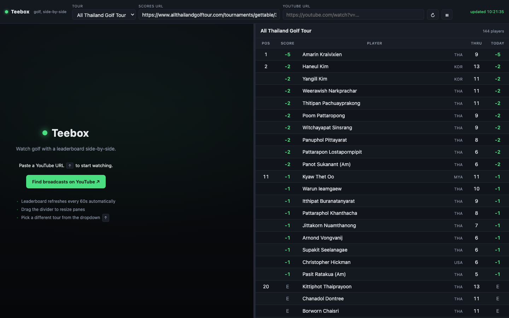

# Teebox

A local, open-source dashboard for watching golf — live stream on the left, leaderboard on the right. Inspired by [multiviewer.app](https://multiviewer.app/) for F1.



Zero external dependencies. Runs on Node 18+. Single HTML page + a tiny proxy server.

## Quick start

**macOS — double-click launcher (easiest):**

1. Download the repo as a zip or clone it
2. Double-click `teebox.command` — Terminal opens, server starts, browser opens automatically

> First time: macOS may block it. Right-click → Open → Open to allow it. You only need to do this once.

**Command line:**

```bash
git clone https://github.com/RosenAdvertising/theteebox-golfviewer.git
cd theteebox-golfviewer
node server/index.js
```

Open http://localhost:8787 in your browser.

**Requirements:** Node.js 18 or newer — [nodejs.org](https://nodejs.org)

1. Pick a tour from the dropdown — PGA, DP World, LIV, LPGA, Korn Ferry, PGA Tour Champions, TGL, All Thailand Golf Tour, or "Custom URL"
2. Paste a YouTube URL
3. Watch + see scores update every 60s

## How it works

The browser blocks direct fetches to most scoring sites due to CORS. The Node proxy bypasses that:

```
browser ──fetch──▶ /proxy?url=... ──▶ Node fetches scoring HTML ──▶ returns to browser
                                                                          │
                                                                  parsed by adapter
                                                                          │
                                                                rendered as table
```

YouTube is embedded directly, no proxy needed.

## Adapters

Each scoring source has a tiny adapter under `public/adapters/`:

```js
export default {
  id: 'allthailand',
  name: 'All Thailand Golf Tour',
  defaultUrl: 'https://www.allthailandgolftour.com/tournaments/gettable/{table_id}/score',
  parse(html) {
    // returns { columns: [...], rows: [...] }
  }
};
```

To add a new tour, drop a new file in `public/adapters/` and register it in `public/adapters/index.js`.

**All Thailand Golf Tour URL:** The `defaultUrl` is intentionally blank — the table ID changes each tournament. Find it by opening the tournament scores page and searching the source for `gettable/NNNNN`. See [`public/adapters/allthailand.js`](public/adapters/allthailand.js) for details.

## Roadmap

Inspired by [MultiViewer for F1](https://multiviewer.app/) — full mapping in [SPEC.md](SPEC.md).

- **v0** (current): YT player + leaderboard, 60s refresh, 9 adapters (PGA, DP World, LIV, LPGA, Korn Ferry, Champions, TGL, All Thailand, Custom URL), graceful empty state
- **v0.x**: Asian Tour + LET adapters (OCS Sport); player highlight/follow; sortable columns; saveable layouts
- **v1**: hole-by-hole scorecard, multi-player compare, score-progression chart per round
- **v1.x**: multi-stream layout (multiviewer-style) — N panes draggable/resizable, picture-in-picture, saved presets
- **v2**: shot tracer / strokes-gained per shot overlays where public APIs allow; hole map with player positions

## License

MIT
